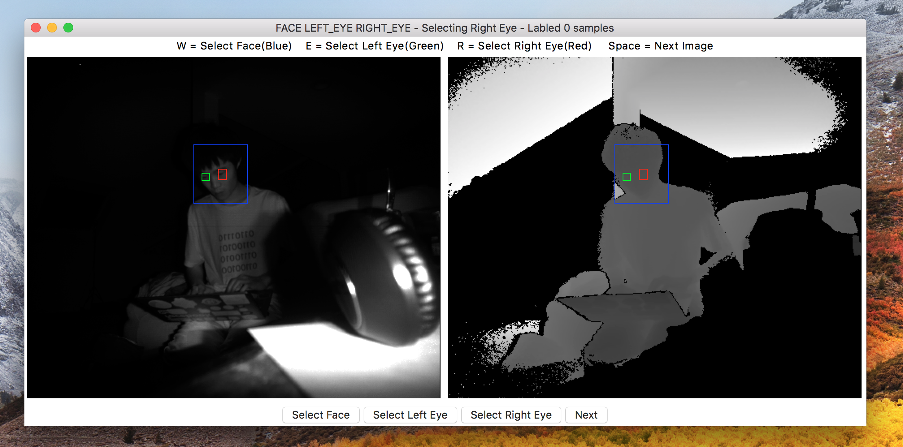

# HeadTracking
Head tracking for NaviRice Systems & related tools

## Getting Started

### Prerequisites

- Python v3.6
- tkinter ( GUI )
- Pillow v4.2.0 ( Image Processing )
- Numpy ( Matrix Computing )

### Running

Navigate into `src`.

#### Recorder
```
python3 tools/record_kinect_to_img.py
```

#### Labeler

Please create a data folder under `src` before you move run the labeler:

```
mkdir data
```

To launch the labeler, run the following command in the terminal:

```
python3 tools/labeler.py
```

The labels will be generated inside `src/data` folder.

Here is the sreenshot of the labeler:




