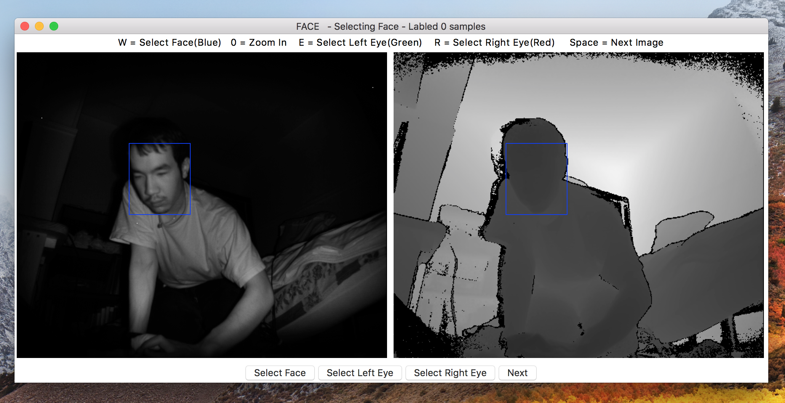
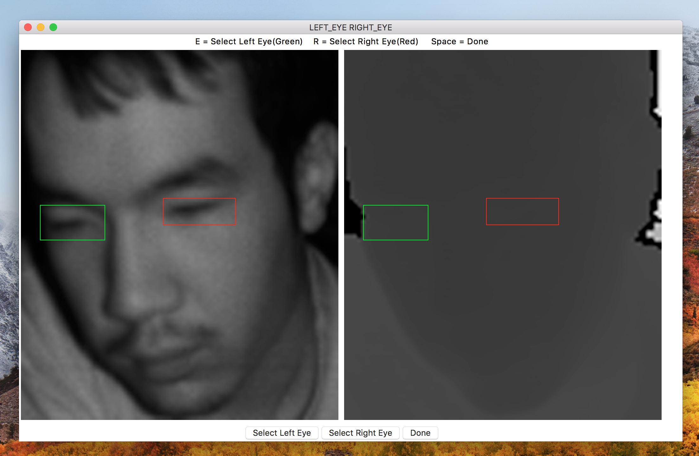
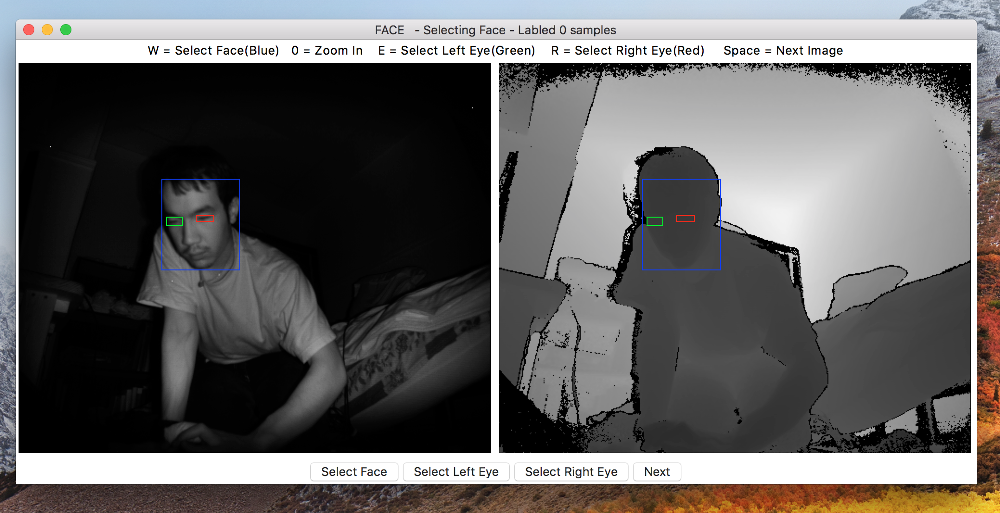

# HeadTracking
Head tracking for NaviRice Systems & related tools

## Getting Started

### Prerequisites

- Python v3.6
- tkinter ( GUI )
- Pillow v4.20 ( Image Processing )
- Numpy ( Matrix Computing )

Run this command in
```
pip install -r requirements.txt
```

### Running

Navigate into `src`.

#### Recorder
```
python3 tools/record_kinect_to_img.py
```

#### Labeler

To launch the labeler, run the following command in the terminal:

```
python3 tools/labeler.py
```

The labels will be generated inside `src/data` folder.

Here is the sreenshot of the labeler:

1. Select face


2. Zoom in around face


3. All features are selected


- **Can Alper** - *Initial work* - [calper-ql](https://github.com/calper-ql)
- **Alex Gaines** - *Initial work* - [roboman2444](https://github.com/roboman2444)
- **Binam Kayastha** - *Initial work* - [binamkayastha](https://github.com/binamkayastha)
- **Yang Liu** - *Initial work* - [byliuyang](https://github.com/byliuyang)

## License
This project is maintained under the MIT License